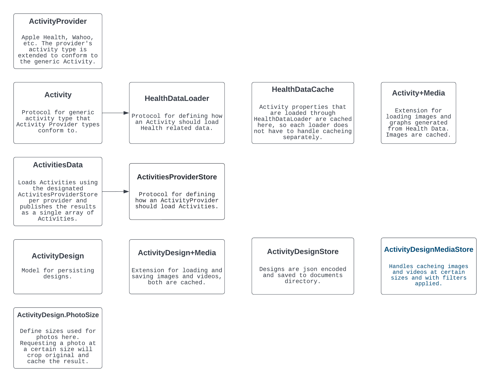

# 🏃 Any Distance

This is the open source version of [Any Distance](https://apps.apple.com/us/app/any-distance-running-tracker/id1545233932), a [2023 Apple Design Award winner](https://www.apple.com/newsroom/2023/06/apple-announces-winners-of-the-2023-apple-design-awards/) in Visuals & Graphics.

Read the announcement blog post [here](https://kuntz.io/blog/any-distance-oss.html).

## 📄 License

This project is released as a gift to the community under a custom source-available license.

- **Personal and non-commercial use**: ✅ Permitted, free of charge
- **Commercial use**: 🔒 Requires prior written consent
  - Consent is typically granted for free to indie developers and small teams
  - To obtain consent, contact [daniel@kuntz.io](mailto:daniel@kuntz.io)

Please see the full license in [`LICENSE`](./LICENSE.md) for details.

## 🤝 Contributing

Contributions are welcome. By submitting a pull request or issue, you agree to grant Any Distance Inc. a perpetual, royalty-free license to use your contribution for any purpose, including in future commercial versions of the app.

See [`CONTRIBUTING`](./CONTRIBUTING.md) and [`SUPPORT`](./SUPPORT.md) for details.

## 🔑 API keys

All API keys have been removed from the project, so most things requiring network requests won't work.

## 🔤 Fonts

All licensed fonts have been removed from the project since the licenses generally don't permit redistribution. The following fonts were originally used in the app. Please seek out proper licenses if you plan on using them in your own project:

- [Presicav](https://fonts.adobe.com/fonts/presicav)
- [Greed](https://displaay.net/typeface/greed-collection/)
- [NeueMatic Compressed](https://www.myfonts.com/collections/neumatic-compressed-font-arkitype?srsltid=AfmBOopqHf3_actVrJng3aprWYdQlXQlVbNUr9PSJFHbUE2iOsZu41mz)
- [Osaka](https://www.dafont.com/osaka-sans-serif.font)
- [Digital 7](https://www.dafont.com/digital-7.font)
- [JD LCD Rounded](https://www.dafont.com/jd-lcd-rounded.font)
- [Nasalization](https://www.dafont.com/nasalization.font)

## 🎞️ HipstaKit SDK

The production version of the app uses HipstaKit, a photo filter SDK licensed to us by [Hipstamatic](https://hipstamatic.com). That SDK is not included in this repo, and all code referencing HipstaKit has been commented out. Please reach out to [lucas@hipstamatic.com](mailto:lucas@hipstamatic.com) for licensing options.

## 🛡️ Trademark Disclaimer

All product names, logos, and brands used in this repository are property of their respective owners.
Use of these names, logos, and brands does not imply endorsement or affiliation.

- Apple®, iMessage®, Fitness®, and Health® are trademarks of Apple Inc.
- Instagram® is a trademark of Meta Platforms, Inc.
- Nike® and NRC® are trademarks of Nike, Inc.
- Garmin® is a trademark of Garmin Ltd.
- Peloton® is a trademark of Peloton Interactive, Inc.
- Strava® is a trademark of Strava, Inc.
- AllTrails® is a trademark of AllTrails, LLC.
- Wahoo® is a trademark of Wahoo Fitness.
- Adidas® is a trademark of Adidas AG.
- Orangetheory® is a trademark of Ultimate Fitness Group, LLC.
- Future®, Gentler®, Fitbod®, and Runkeeper® are trademarks of their respective owners.
- Twitter® and X® are trademarks of X Corp.

Icons and logos used in this project are for illustrative/reference purposes only.
Any use of third-party trademarks is intended to comply with fair use principles.

## ✅ Getting Started

Run `pod install`. You will be prompted to enter keys for some external services we use like Wahoo, Garmin, etc. You can enter blank or dummy strings if you don't have a developer account with Wahoo / Garmin.

- [Wahoo Developer Portal](https://developers.wahooligan.com/applications)
- [Garmin Developer Portal](https://developerportal.garmin.com/user/me/apps?program=829)

## 📲 Activity Loading

This is a general overview of the classes and protocols related to loading Activities. Since we load Activities from several different sources, the generic Activity type should be used across the app instead of trying to use concrete types from specific providers. The goal is to abstract away services like HealthKit, Wahoo, Garmin, etc as much as possible, and confine them to the `ActivityProviderStore` and `HealthDataLoader`.
